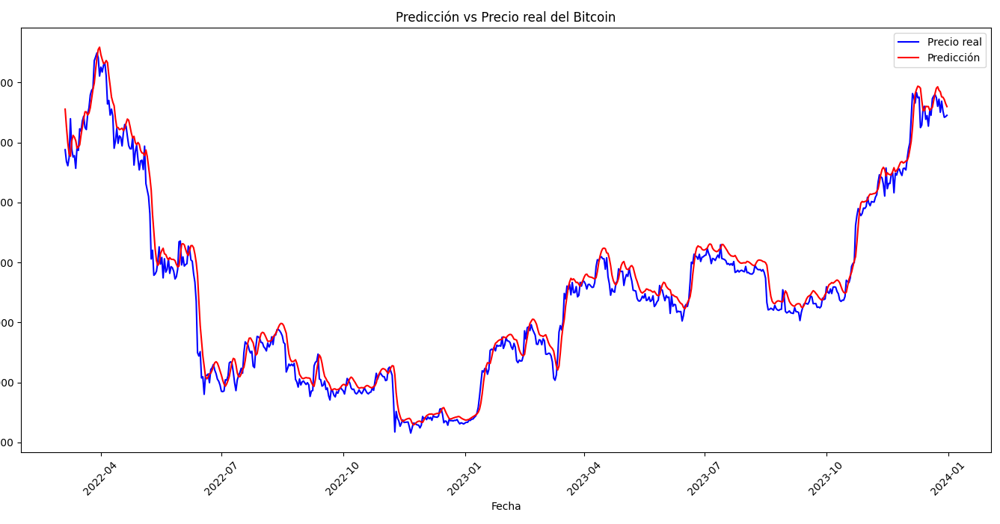
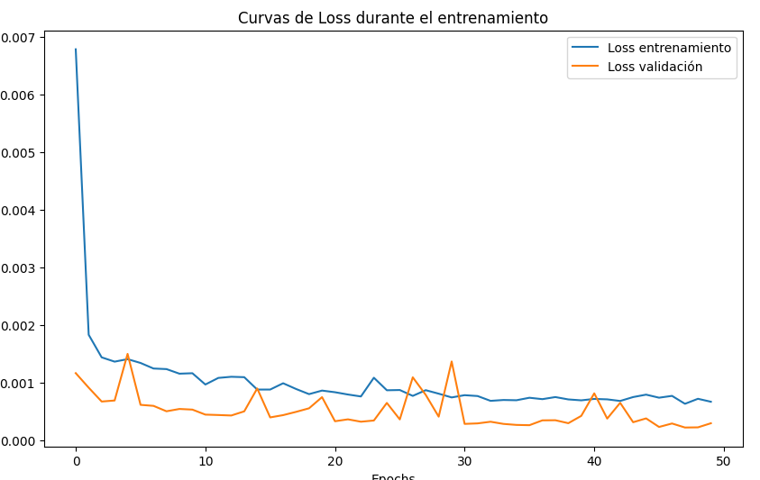

# Predicción del Precio del Bitcoin con LSTM

Este proyecto utiliza una red neuronal LSTM para predecir la tendencia del precio del Bitcoin en dólares, entrenando el modelo con datos históricos desde 2009. El modelo analiza los últimos 60 días para predecir el próximo valor, visualizando las predicciones frente a los precios reales.

## 📂 Estructura del Proyecto
- **bitcoin_price_prediction.ipynb**: Notebook principal del proyecto.
- **requirements.txt**: Lista de dependencias necesarias.

## 📊 Resultados
Las predicciones se visualizan en un gráfico comparativo entre los precios reales y las predicciones, junto con las curvas de pérdida durante el entrenamiento.

## 🚀 Cómo Usar
1. Clona este repositorio: git clone https://github.com/Marioxda1/Bitcoin-Insight-AI.git
2. Instala las dependencias: pip install -r requirements.txt

## 🛠️ Tecnologías Utilizadas
- Python
- TensorFlow
- Pandas
- Numpy
- Matplotlib
- Scikit-learn

## 🤝 Contribuciones
Si tienes ideas para mejorar este proyecto, ¡no dudes en hacer un fork y enviar tus sugerencias!

